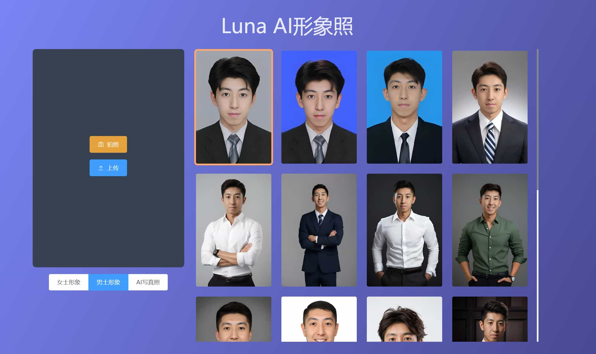

<h1 align="center" style="margin: 10px 0 10px; font-weight: bold;">Luna AI形象照</h1>
<h3 align="center" style="margin-bottom: 10px;">一张照片免费制AI形象照，适用于简历/高管形象/证件照等场景
</h3>
<p align="center">
<a href="#"></a>
<a href="#"></a>
<a href="#"></a>
<a href="#"></a>
</p>

## 简介 Introduction

支持自定义换装、换发型

算法能力由 [Luna AI](https://github.com/loxi-opensource/luna-swapping) 强力支持


## 演示 Live Demo

体验地址：[https://luna-headshot.sodair.top](https://luna-headshot.sodair.top)

<table>
	<tr>
        <td width="20%">支持相机拍摄、本地文件上传</td>
        <td></td>
    </tr>
	<tr>
        <td>AI生成</td>
        <td></td>
    </tr>
	<tr>
        <td>制作完成</td>
        <td></td>
    </tr>
</table>

## 部署运行 How to run

```bash
# 安装依赖
yarn install

# 启动服务
yarn dev
```

## 了解更多 Learn More

<table>
    <tr>
        <td width="30%">
            
        </td>
        <td width="30%">
        
        </td>
        <td>
            <p>邮箱: zhoukai@iartai.com</p>
            <p>
                算法来源：<a href="https://github.com/loxi-opensource/luna-swapping">Luna AI换脸开源项目</a>
            </p>
        </td>
    </tr>
    <tr>
        <td align="center">
            小程序
        </td>
        <td align="center">
            开发者微信
        </td>
    </tr>
</table>
